# GitHub_Android(GitDroid)


A simple client for GitHub.


# Install

Application of treasure(应用宝):http://sj.qq.com/myapp/detail.htm?apkName=com.zpauly.githubapp

Coolapk(酷安):http://www.coolapk.com/apk/com.zpauly.githubapp


# Features Provided

### User profile

* Followers and followings
* Events that a user has received
* Repositories for the specified user
* Organizations for the specified user

### Repositories

* Watch
* Star
* Fork
* Commits
* Branches
* Releases
* Contributors
* ReadMe
* Files
* Download source code

### Issues

* Create an issue
* List all issues
* Labels
* Milestones

### Explore

* Explore repositories or users

### Gists

* User gists, all gists and starred gists

### Settings

* Code style
* Night theme


### More Features will be added in the future


# Screenshots


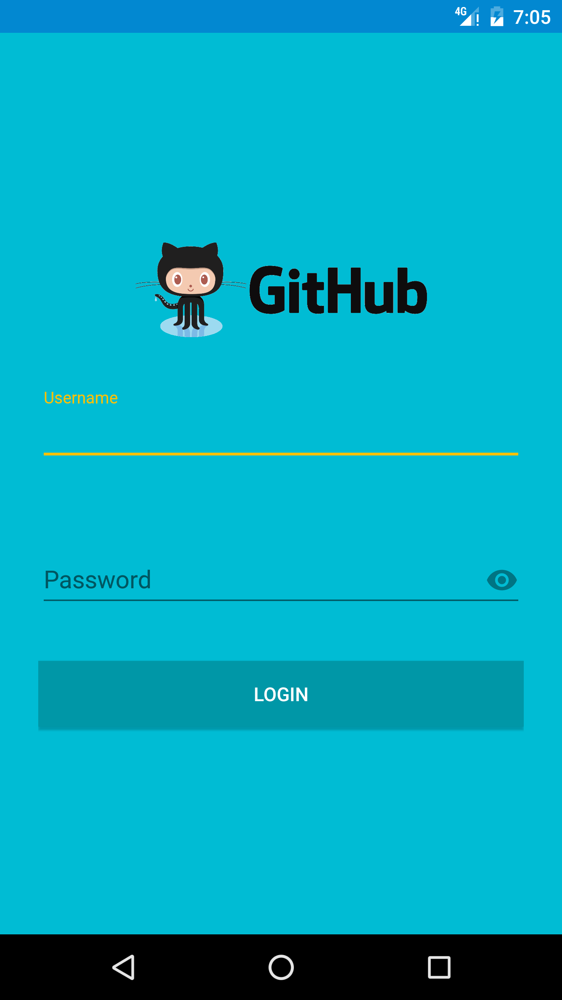
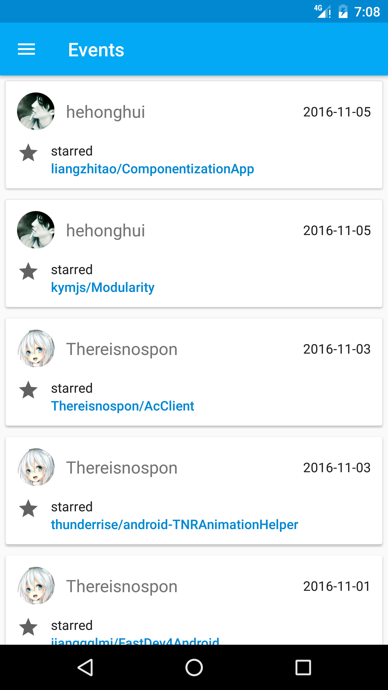
<br/>
<br/>
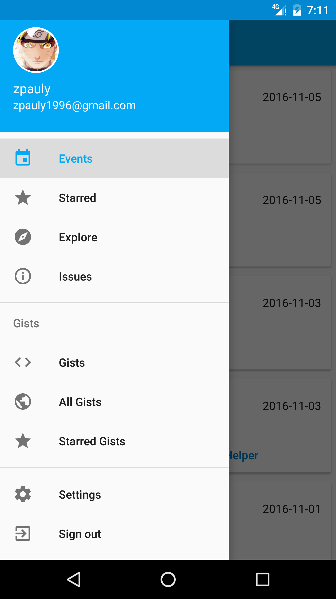
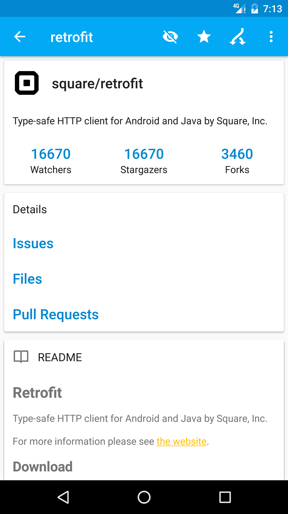
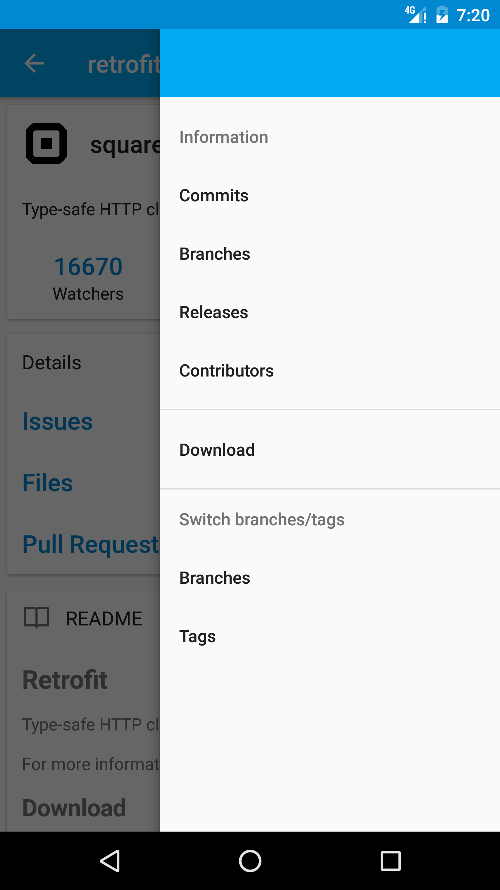
<br/>
<br/>
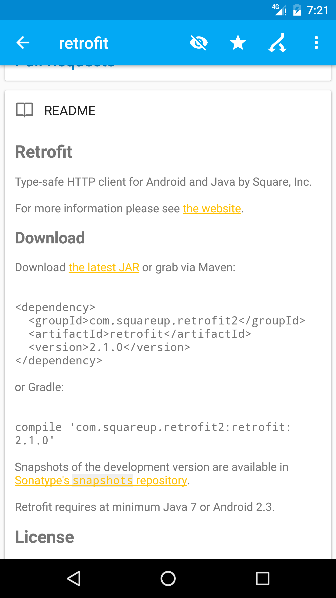
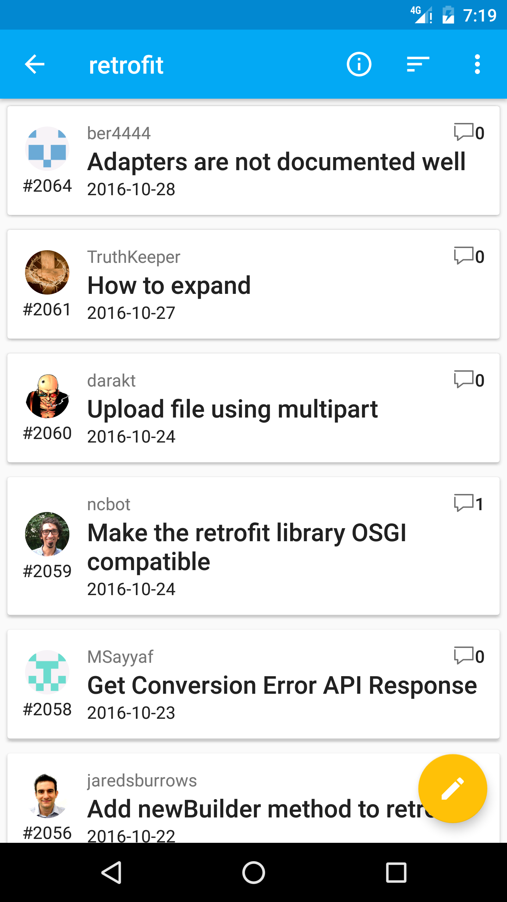
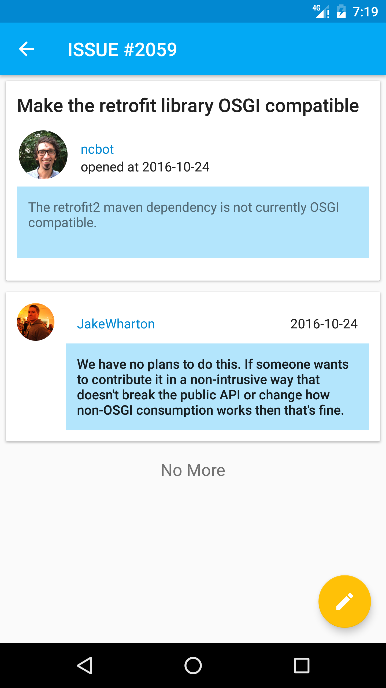
<br/>
<br/>
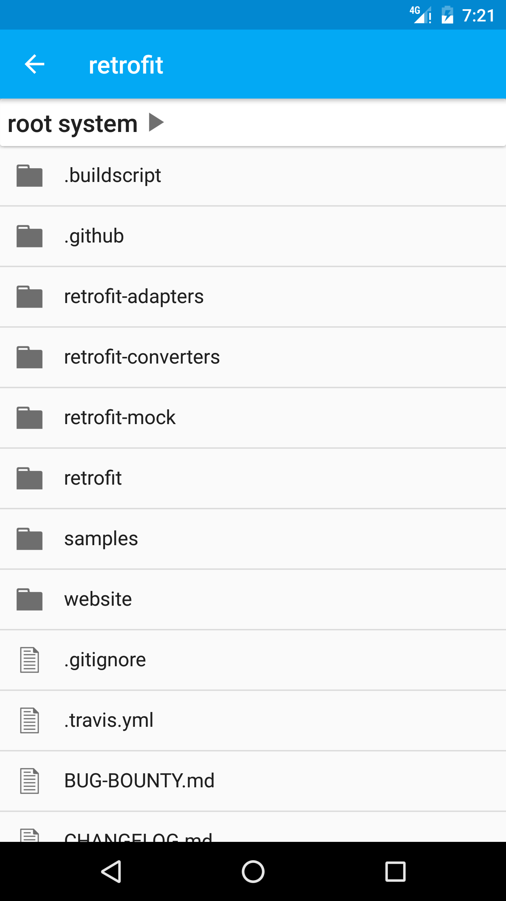
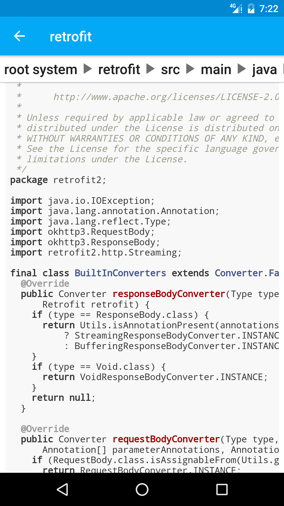
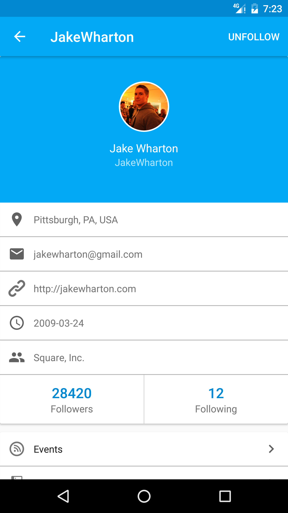
<br/>
<br/>
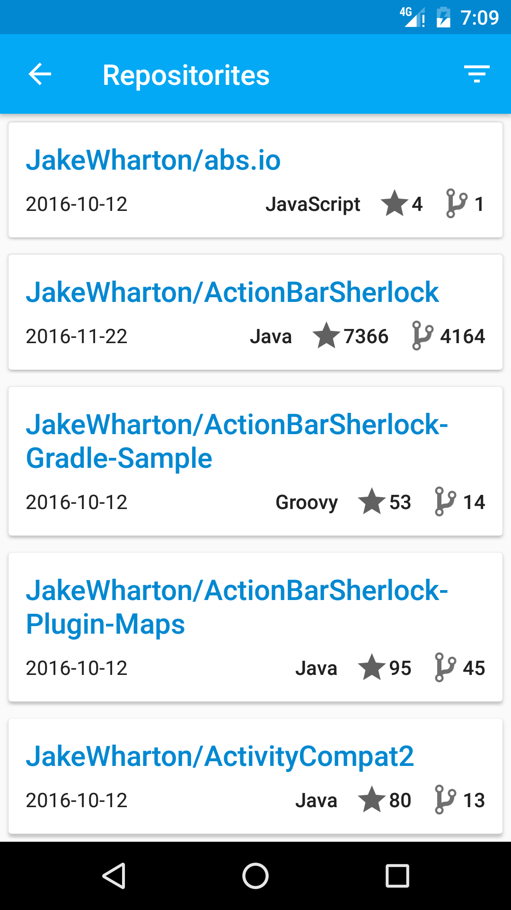
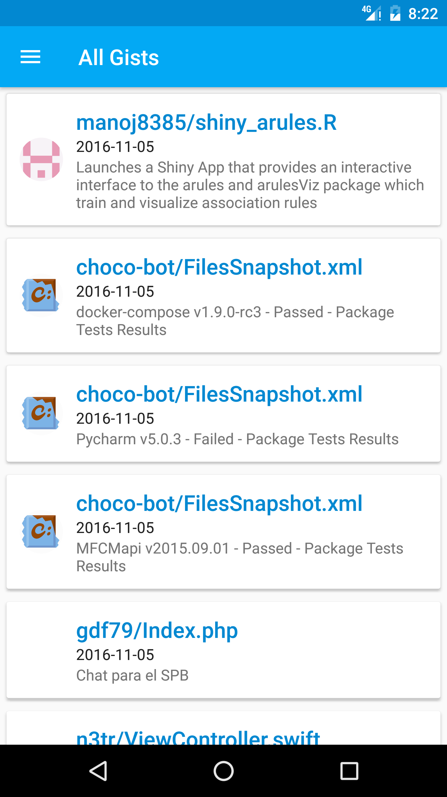
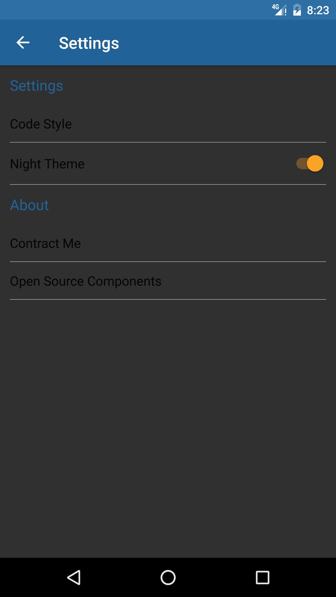


# Last

If you have issues or suggestions about this project, any kind of feedback is welcome.

Email:[zpauly1996@gmail.com](mailto:zpauly1996@gmail.com)


# License

```
Copyright 2016 zpauly

Licensed under the Apache License, Version 2.0 (the "License");
you may not use this file except in compliance with the License.
You may obtain a copy of the License at

   http://www.apache.org/licenses/LICENSE-2.0

Unless required by applicable law or agreed to in writing, software
distributed under the License is distributed on an "AS IS" BASIS,
WITHOUT WARRANTIES OR CONDITIONS OF ANY KIND, either express or implied.
See the License for the specific language governing permissions and
limitations under the License.
```

